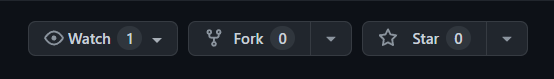
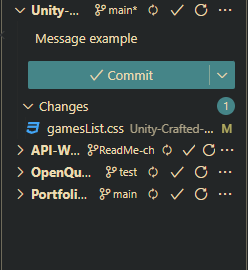

# UNITY Crafted Indies

<!-- ALL-CONTRIBUTORS-BADGE:START - Do not remove or modify this section -->
[](#contributors-)
<!-- ALL-CONTRIBUTORS-BADGE:END -->

**Welcome To **UCI**! Want a place to showcase your game? This is it.**

This project's purpose is to be a hub where you can add **your own game** made with UNITY and share it with others on **Github**

**Live Website Link**: [UCI Active Site Link](https://delta7actual.github.io/Unity-Crafted-Indies/)

## Contributors

We would like to acknowledge and thank you very much!

<!-- ALL-CONTRIBUTORS-LIST:START - Do not remove or modify this section -->
<!-- prettier-ignore-start -->
<!-- markdownlint-disable -->
<table>
  <tbody>
    <tr>
      <td align="center" valign="top" width="14.28%"><a href="https://github.com/Arad05"><br /><sub><b>Arad05</b></sub></a><br /><a href="#content-Arad05" title="Content">🖋</a></td>
      <td align="center" valign="top" width="14.28%"><a href="https://github.com/WDmaster235"><br /><sub><b>WDmaster235</b></sub></a><br /><a href="#content-WDmaster235" title="Content">🖋</a> <a href="https://github.com/Delta7Actual/Unity-Crafted-Indies/commits?author=WDmaster235" title="Code">💻</a></td>
      <td align="center" valign="top" width="14.28%"><a href="https://github.com/Delta7Actual"><br /><sub><b>Delta7Actual</b></sub></a><br /><a href="https://github.com/Delta7Actual/Unity-Crafted-Indies/commits?author=Delta7Actual" title="Code">💻</a> <a href="#design-Delta7Actual" title="Design">🎨</a></td>
      <td align="center" valign="top" width="14.28%"><a href="http://fahass.github.io/Portfolio"><br /><sub><b>Umar Farouk</b></sub></a><br /><a href="https://github.com/Delta7Actual/Unity-Crafted-Indies/commits?author=Fahass" title="Code">💻</a></td>
    </tr>
  </tbody>
</table>

<!-- markdownlint-restore -->
<!-- prettier-ignore-end -->

<!-- ALL-CONTRIBUTORS-LIST:END -->

<!-- ALL-CONTRIBUTORS-LIST:START - Do not remove or modify this section -->
<!-- prettier-ignore-start -->
<!-- markdownlint-disable -->

## How to contribute



### 1. Fork this Repository

**Make sure you have Git installed on your machine** (Install it [HERE](https://docs.github.com/en/get-started/quickstart/set-up-git))

- Press the "Fork" button on the top right of the repository page.
- This will create a copy of this repository in your personal Github account.

### 2. Clone the Repository


- Clone your forked repository to your local machine. In your GitHub account, navigate to your forked repository and click the "Code" button. Copy the URL.

- Open your terminal and run the following command, replacing `"url you just copied"` with the URL you copied:

```shell
git clone "URL you just copied"
```

For example:

```shell
git clone git@github.com:this-is-you/Unity-Crafted-Indies.git
```

### 3. Create a new branch

If you're not already in the repository directory, navigate to it by typing:

```shell
cd Unity-Crafted-Indies
```

Now, create a new branch in your repository to implement your changes by typing:

```shell
git switch -c add-your-name
```

Replace "add-your-name" with a branch name that describes your contribution.

### 4. Make your changes and commit



- Add your contribution (For example, adding a game).
- Commit your changes with a meaningful message in the **"Source Control"** tab.
- Click **"Publish branch"** (This will add the changes to your personal repo).
